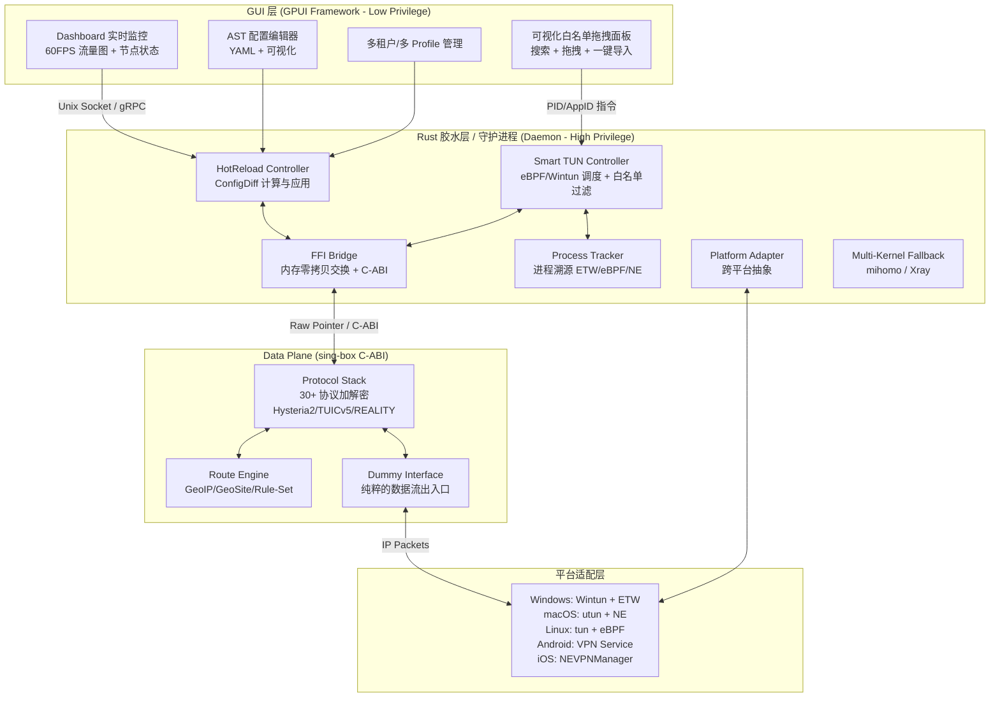
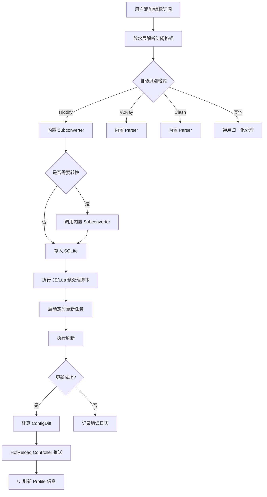
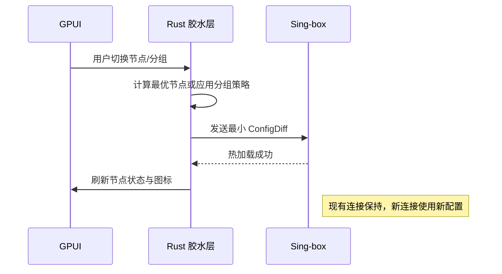
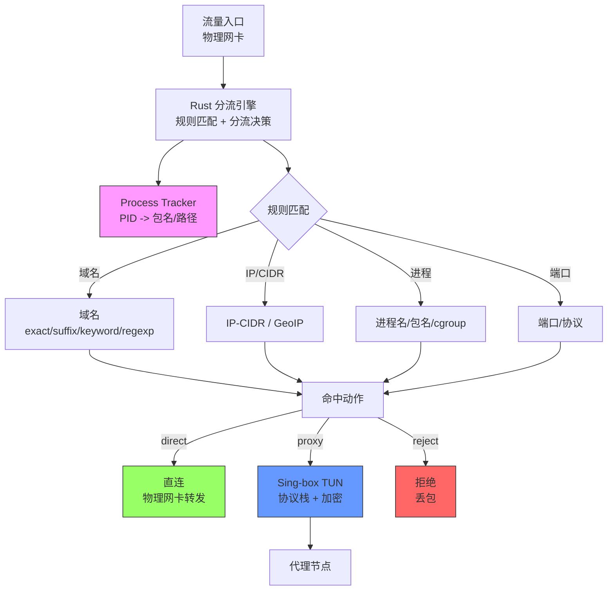
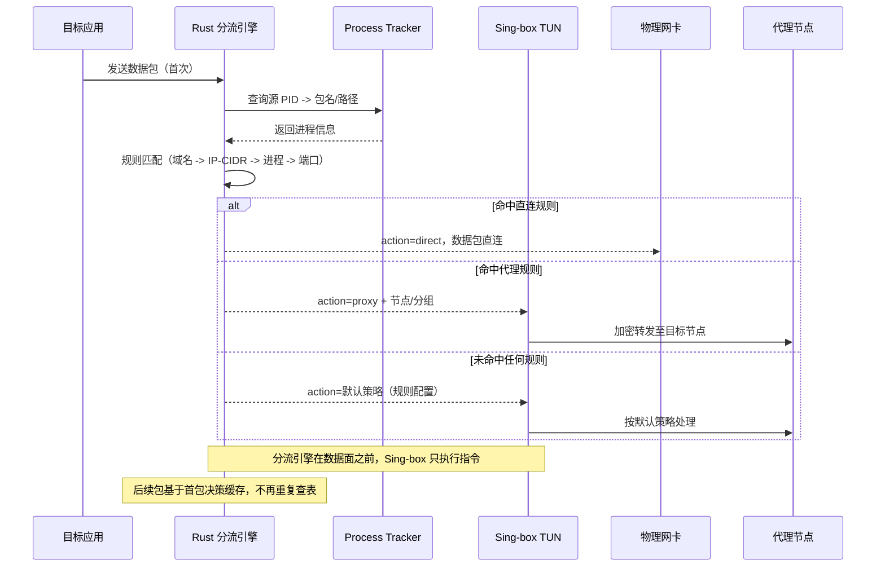
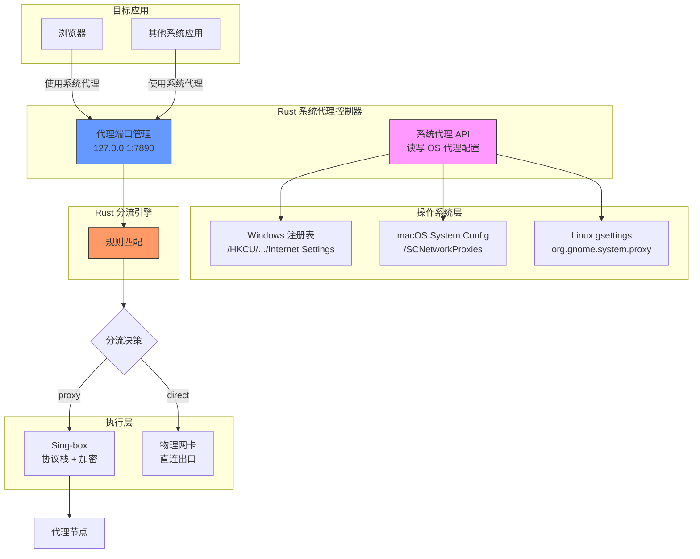
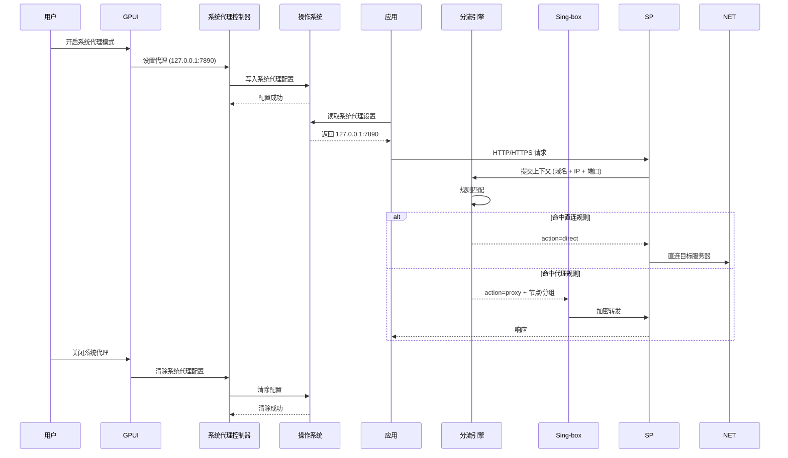
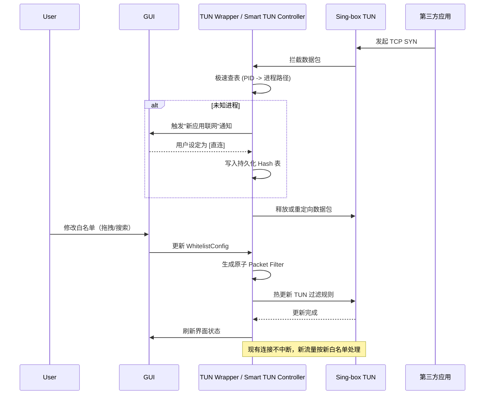
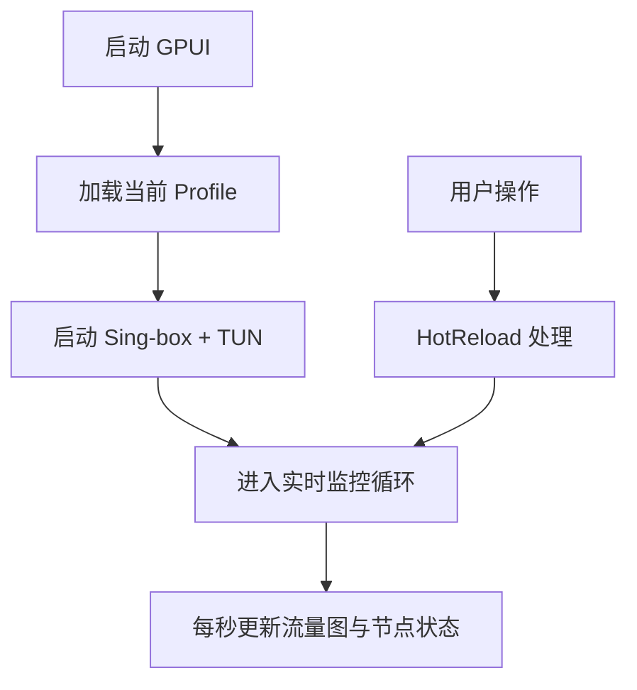

# 功能设计方案：跨平台高性能代理引擎（GPUI Proxy Engine / 源梯）

**版本说明**：V7.0（整合优化版，融合两大方案之所长）
**架构策略**：自研 Rust 守护进程（Control Plane）+ Sing-box 核心动态库（Data Plane）+ GPUI 表现层
**核心定调**：打造本地流量的"中心网关"，以统一反向代理与调度的思维，彻底解决传统代理工具配置割裂、热更断网、TUN 权限失控的顽疾。同时集 Clash Verge Rev、Clash Meta (mihomo)、Karing、Hiddify Next 四款工具之所长，彻底解决各自痛点。

---

## 1. 产品定位与核心愿景

本系统旨在集聚现有开源工具之所长，并填补其在架构设计上的先天缺陷：

- **突破 Verge 的性能与定制瓶颈**：抛弃繁重的 Electron / Webview 架构，使用 Rust 原生 GPU 渲染，彻底放开配置层的定制能力。
- **降维 Meta 的历史包袱**：采用现代化的双向 IPC 通信机制取代传统的 YAML 文件全量重载，实现热更新零中断。
- **重塑 Karing 与 Hiddify 的稳定性**：剥离协议核心与系统管控权限，通过独立的 Rust 胶水层精确控制物理网卡状态，消除 TUN 模式下的路由回环与"鬼畜"断连。

**核心策略**：
- Sing-box 作为协议核心（负责所有加解密、协议栈、基础规则、TUN 底层，由社区长期验证）
- Rust 胶水层（自研）负责热更新、白名单过滤、可视化配置、立即生效、跨平台抽象
- GUI 使用 GPUI 原生渲染（桌面 + gpui-mobile）
- 配置变更立即生效（零重启、零中断）
- 完整跨平台支持：Windows、macOS、Linux、Android、iOS（覆盖 x86_64、aarch64、armv7、x86 等所有架构，Linux 所有主流发行版）

---

## 2. 整体架构设计

### 2.1 系统架构图

系统采用严密的三态隔离架构：GUI 用户态、Daemon 高权限系统态、Core 协议处理管道。



### 2.2 核心技术要点

- **FFI 零拷贝通信**：通过 `std::pin::Pin` 在 Rust 侧锁定内存块，将原始数据包指针通过 C-ABI 直接传递给 Go 侧的 Sing-box 实例，避免跨语言 GC 带来的 CPU 抖动。
- **异步桥接 (Async Bridge)**：Rust Tokio 运行时与 Go Goroutine 的深度融合。Go 侧协议解密完成后，通过函数指针回调触发 `Waker.wake()`，唤醒 Rust 侧的 Future 发送数据。
- **热重载控制器 (HotReload)**：配置变更时，胶水层在内存中比对当前配置树（AST）生成最小 Diff。仅向协议层下发变更的节点或规则指令，不销毁当前 TCP 句柄，<200ms 生效。
- **进程溯源 (Process Tracker)**：
  - Windows: 依赖 ETW (Event Tracing) 捕获瞬间连接的 PID
  - Linux: 深度挂载 cgroup v2，结合 eBPF socket_filter 在内核态直接阻断或放行流量
  - macOS/iOS: 基于 Apple NetworkExtension 原生标识
- **防回环机制 (Anti-Loop)**：守护进程启动 TUN 后，自动检测并绑定底层物理网卡（如 eth0/wlan0），强制自身发出的加密流量绕过 TUN 路由表。
- **密钥使用平台原生安全存储**：Keychain / Keystore / TPM

### 2.3 移动端特定架构

- Android: VPN Service + 前台服务 + 心跳检测(2s) + 自动重置 + 缓冲流量重放
- iOS: NEVPNManager + NetworkExtension

---

## 3. 订阅与配置管理

### 3.1 详细功能清单

- **多订阅源支持**：URL、本地文件、GitHub、Hiddify 远程、Base64 等多种格式
- **多源归一化解析**：内置 Rust 编写的通用 Parser，自动识别并展平 Hiddify、V2Ray、Clash 等各种非标订阅格式
- **脚本化预处理 Pipeline**：支持加载 JavaScript 钩子脚本。订阅下载后，数据流经 JS 引擎进行预处理（如正则筛选节点、动态调整负载均衡权重），再存入 SQLite 数据库
- **配置覆盖策略**：严格遵循 `远端订阅 -> 本地 Script 覆写 -> UI 临时规则` 的优先级链路
- **自动更新机制**：定时（5/15/30/60 分钟）、流量触发、手动刷新
- **配置合并（Merge）与脚本预处理（JavaScript / Lua）**
- **配置编辑器**：语法高亮、实时校验、错误提示、一键格式化
- **多 Profile 切换、自动备份、版本回滚**
- **Profile 信息面板**：剩余流量、到期天数、节点数量、最后更新时间

### 3.2 订阅更新流程图



### 3.3 技术实现要点

- 订阅解析器完全在 Rust 实现，支持多种格式自动识别
- 变更后立即触发热更新，无需用户手动点击"应用"
- 所有操作零重启

---

## 4. 节点与代理分组

### 4.1 详细功能清单

- **全协议栈降维打击**：由经过社区海量验证的 Sing-box 核心兜底，支持 Hysteria 2、TUIC v5、ShadowTLS、REALITY 等前沿协议
- **节点列表**：搜索、排序（延迟、速度、名称、类型）
- **节点标签系统 + 快速过滤**
- **延迟测试**：全量测试、选中测试、后台智能测试
- **无阻塞并发测速**：由 Rust 胶水层直接发起基于真实 HTTP/HTTPS 握手的并发延迟测试，不占用主协议栈的吞吐资源
- **代理分组**：Select、URL-Test、Fallback、Load-Balance、Relay 全支持
- **策略组拓扑**：支持嵌套层级无限制的 URL-Test、Fallback 和 Load-Balance
- **节点图标、自定义组图标、实时状态显示**
- **自动最低延迟节点选择（Hiddify 风格）**
- **多跳代理链（任意层级）**

### 4.2 节点切换时序图



### 4.3 多跳链路可视化（补充）

UI 层通过 D3.js 或 GPUI Canvas 动态绘制流量的多跳（Multi-hop）链路图，实时显示各节点延迟与负载状态。

### 4.4 技术实现要点

- 延迟测试结合 Sing-box 内置机制与 Rust 并行优化
- 多跳链在胶水层构建后透传给 Sing-box

---

## 5. 分流引擎（核心重点模块）

本系统分流模块参考 Karing 的设计理念，具备**极致灵活**与**强力可控**的特性，同时在 TUN 模式下完整支持分流能力。

### 5.1 分流核心特性（Karing 风格）

#### 5.1.1 多维度分流匹配

- **域名分流（Domain Matcher）**：
  - 完整域名匹配（exact）
  - 域名后缀匹配（suffix）
  - 域名关键词匹配（keyword）
  - 域名正则匹配（regexp）
  - CIDR IP 段匹配（ip-cidr）
  - GeoIP 地理位置匹配

- **进程级分流**：
  - 进程名匹配（process-name）
  - 进程路径匹配（process-path）
  - 包名匹配（package-name，适用于 Android）
  - Bundle ID 匹配（bundle-id，适用于 iOS/macOS）
  - cgroup v2 路径匹配（Linux）

- **网络层分流**：
  - 源IP/目标IP 精确匹配
  - 端口匹配（源端口 + 目标端口）
  - 协议类型（TCP/UDP/ICMP）
  - HTTP/HTTPS 主机头匹配

#### 5.1.2 分流规则结构

```yaml
rules:
  - name: "国内直连"
    type: domain-suffix
    payload: ["cn", "com.cn", "net.cn"]
    action: direct

  - name: "海外代理"
    type: domain-keyword
    payload: ["google", "facebook", "twitter"]
    action: proxy

  - name: "应用分流-微信"
    type: package-name
    payload: ["com.tencent.mm"]
    action: direct

  - name: "应用分流-Telegram"
    type: package-name
    payload: ["org.telegram"]
    action: proxy

  - name: "IP 段分流"
    type: ip-cidr
    payload: ["10.0.0.0/8", "172.16.0.0/12"]
    action: direct

  - name: "广告拦截"
    type: domain-match
    payload: ["ads.example.com"]
    action: reject
```

#### 5.1.3 分组与链式规则

- **规则分组（Rule Group）**：
  - 支持创建多个自定义分流规则组
  - 每个分组可包含多条规则
  - 分组可嵌套（父分组 -> 子分组）
  - 优先级：规则组内按顺序匹配，命中即停

- **链式转发（Chain/Relay）**：
  - 支持多跳链式转发：App -> Proxy A -> Proxy B -> Target
  - 链中每个节点可独立指定代理策略（直连/代理/拒绝）
  - 链式规则可在 TUN 和代理模式通用

#### 5.1.4 分流行为动作

| 动作 | 说明 |
|------|------|
| `direct` | 直连（不走代理） |
| `proxy` | 使用选定的代理节点/分组 |
| `reject` | 拒绝连接（丢包） |
| `dnstunnel` | DNS 隧道（特殊处理） |
| `chain` | 链式转发至下一跳 |

### 5.2 分流编辑器（可视化 + YAML 双模式）

#### 5.2.1 可视化编辑器

- **树形规则编辑器**：以树形结构展示规则分组，支持拖拽重排序、折叠/展开
- **表单模式**：每个规则提供清晰的字段输入表单
  - 规则名称（友好标识）
  - 匹配类型（下拉选择）
  - 匹配 payload（多行输入）
  - 目标动作（单选）
  - 备注/标签
- **批量导入**：支持从文件/订阅导入规则
- **规则冲突检测**：自动检测规则冲突并高亮提示

#### 5.2.2 YAML 模式

- 支持直接编辑 YAML 源码
- 语法高亮 + 实时校验
- 一键格式化
- 从可视化模式切换时不丢失数据

#### 5.2.3 规则导入/导出

- 导入：支持 ACL、Surge、Clash 等格式转换
- 导出：可导出为通用格式或平台特定格式
- 远程规则订阅：支持加载远程规则集（Rule-Set URL）

### 5.3 TUN 模式下的分流

#### 5.3.1 TUN 分流架构

分流引擎（Rust）在 TUN 数据面之前做决策，Sing-box 只是个执行者。



**关键**：分流决策在流量进入 Sing-box 之前完成，Sing-box 只负责执行（直连/代理）。

#### 5.3.2 TUN 分流核心特性

- **分流引擎前置**：Rust 分流引擎在 Sing-box 数据面之前决策，Sing-box 只执行（直连/代理）指令
- **首包快速匹配**：流量入口处基于首包 IP/端口/域名进行快速分流决策，零延迟引入
- **进程感知分流**：结合 Process Tracker 的 PID -> 包名/路径映射，实现 Per-App 分流
- **域名预取（FakeIP）**：TUN 模式下启用 FakeIP 模式，DNS 解析结果缓存于本地，域名分流规则在连接时立即生效
- **Split HTTP 分流**：支持 HTTP CONNECT 请求的域名级分流（HTTP/1.1 Upgrade 场景）
- **TUN 分流规则与代理模式规则100%一致**：同一套规则系统，无需分开配置

#### 5.3.3 TUN 分流工作流程

流量先到 Rust 分流引擎决策，再送 Sing-box 执行。



#### 5.3.4 FakeIP 与增强模式

- **FakeIP 模式**：启用后，DNS 解析返回虚拟 IP，分流引擎基于 FakeIP 快速匹配域名规则
- **增强模式**：支持更多复杂场景（如 Trojan/VLESS 回落分流）

### 5.4 分流调试与诊断

- **实时匹配日志**：每条连接显示命中的规则名称与动作
- **规则命中高亮**：Dashboard 实时显示各规则组的命中统计
- **连接追踪**：每个连接的完整路径可视化（起点 -> 分流决策 -> 代理节点 -> 目标）
- **分流模拟器**：输入域名/IP，模拟查看命中规则

### 5.5 技术实现要点

- **双引擎分流**：Sing-box 高效 Radix 树执行 IP/CIDR/Geo 匹配；Rust eBPF 层在协议栈前执行进程/域名特征匹配
- **规则引擎热更新**：修改规则后无需重启，<200ms 生效
- **规则持久化**：SQLite 存储规则集，支持版本回滚
- **TUN 分流性能**：首包查表 <1ms，CPU 占用 <5%

### 5.6 系统代理模式（非 TUN）

系统代理模式和 TUN 模式共用同一套分流引擎。通过直接读写操作系统网络代理配置，使系统内所有应用自动走代理。

#### 5.6.1 两种模式对比

| 维度 | TUN 模式 | 系统代理模式 |
|-----|---------|------------|
| **流量捕获** | IP 层劫持，所有 TCP/UDP | 修改系统代理设置，应用层转发 |
| **适用范围** | 全局分流、游戏、客户端应用 | 浏览器、大部分系统应用 |
| **权限需求** | 需创建 TUN/VPN | 普通用户权限即可 |
| **配置方式** | 应用无需适配 | 应用自动使用系统代理 |
| **进程感知** | ✅ eBPF/ETW 全局追踪 | ❌ 无法追踪进程（系统级） |

#### 5.6.2 系统代理模式核心能力

**直接读写操作系统网络代理配置**：

| 平台 | 实现方式 |
|-----|---------|
| **Windows** | WinHTTP API `InternetSetOption` + 注册表 `HKCU\Software\Microsoft\Windows\CurrentVersion\Internet Settings` |
| **macOS** | System Configuration 框架 `SCNetworkProxies` |
| **Linux** | gsettings (GNOME/KDE)、Desktop 文件、environment 变量 |
| **Android** | 写入 `APN` 设置或使用 VpnService 拦截 |
| **iOS** | NEVPNManager 设置代理（需用户授权） |

**代理协议支持**：

- HTTP 代理（带认证）
- SOCKS5 代理（带认证）
- HTTPS 代理（TLS 加密）

#### 5.6.3 系统代理模式架构



#### 5.6.4 系统代理工作流程



#### 5.6.5 实现要点

- **系统代理读写**：Rust 层封装各平台 API，透明读写系统代理配置
- **代理端口监听**：本地 HTTP/SOCKS5 代理（127.0.0.1:7890）接收应用流量
- **规则分流**：代理端口的流量进入 Rust 分流引擎，按规则直连或代理
- **开机自启**：可通过系统启动项/登录项实现代理自启
- **PAC 代理**：支持 PAC（Proxy Auto-Config）文件，可动态生成规则
- **代理认证**：支持用户名/密码认证，安全存储于 Keychain/Keystore

#### 5.6.6 模式切换

- 用户可在 UI 一键切换：TUN 模式 / 系统代理模式 / 直连模式
- 切换时自动写入/清除系统代理配置，热更新生效
- 不同 Profile 可绑定不同默认模式
- 异常退出时自动恢复系统代理设置为空

---

## 6. 代理模式与网络控制（TUN 白名单重点模块）

### 6.1 详细功能清单

- **模式切换**：全局、规则、直连
- **系统代理模式 + 守护进程**
- **TUN 模式全局劫持**
- **白名单 / 黑名单模式（极低学习成本）**
- **全平台进程溯源 (Process Tracker)**：
  - Windows: 依赖 ETW (Event Tracing) 捕获瞬间连接的 PID
  - Linux: 深度挂载 cgroup v2，结合 eBPF socket_filter 在内核态直接阻断或放行流量
  - macOS/iOS: 基于 Apple NetworkExtension 原生标识
- **Per-App 分流（支持进程名、包名、路径、Bundle ID）**
- **IPv4 / IPv6 双栈独立控制**
- **Fake IP 与增强模式**

### 6.2 TUN 白名单可视化交互

- **沉浸式白名单交互**：UI 面板自动扫描系统中具有网络请求特征的独立应用
- 搜索框实时搜索已安装应用
- 一键导入全部已安装 App
- 左右拖拽列表（白名单 / 黑名单）
- 模式切换开关（全局 / 白名单 / 黑名单）
- 用户无需手写 YAML，只需在图标列表中执行拖拽（入围白名单/黑名单），底层即刻生成基于 Process-name 或 cgroup 的绕过规则
- 高级用户可直接编辑 YAML 配置

### 6.3 TUN 白名单工作时序图



### 6.4 TUN 稳定性机制

- 心跳检测每 2 秒一次
- 检测到异常 → 自动重置 TUN 设备 + 缓冲流量重放
- **零鬼畜目标**：CPU 占用 < 5%
- 防回环机制（Anti-Loop）：守护进程启动 TUN 后，自动检测并绑定底层物理网卡（如 eth0/wlan0），强制自身发出的加密流量绕过 TUN 路由表

### 6.5 技术实现要点

- Rust Smart TUN Controller 在 Sing-box 基础 TUN 之上增加 eBPF/Wintun 过滤层
- 移动端：Android 使用 VPN Service + 前台服务；iOS 使用 NEVPNManager

---

## 7. 监控、日志、UI 与高级特性

### 7.1 详细功能清单

- **实时流量可视化**：60FPS 的实时速率折线图、连接活跃分布热力图、折线图、柱状图
- **连接详情、速度曲线、节点地图**
- **日志系统**：过滤、规则命中高亮、导出
- **本地零日志策略**，密钥安全存储
- **主题**：自定义颜色、暗黑模式、毛玻璃效果
- **快捷操作**：托盘菜单、快捷键、移动通知栏
- **诊断工具**：Ping、MTR、DNS 测试、一键生成报告
- **性能监控与自动优化**
- **插件系统（Rust + JavaScript）**
- **离线模式与本地规则缓存**
- **支持企业级多租户配置共享**

### 7.2 主界面启动与监控流程图



### 7.3 GUI 特殊优化

- **GPUI 原生渲染**：抛弃 Web DOM 树，追求零延迟响应。UI 规范全面向 Ant Design Pro 严谨的专业级仪表盘美学靠拢，摒弃花哨，追求极客效能。
- **原生输入法与窗口管理器支持**：特别针对 Linux 发行版优化。在 Fedora 等采用 Wayland 混成器的系统下，提供 Native 渲染级支持，彻底解决 XWayland 下的缩放模糊问题，并确保与 fcitx5 (Rime) 等输入法框架的事件循环完美兼容，无吞字、候选框错位现象。

---

## 8. 平台特定优化与打包发布

### 8.1 构建系统

**自动化构建矩阵**：依托 GitHub Actions，实现全平台架构的自动交叉编译。

**Windows**：
- 架构：x86_64、x86（i386）、aarch64、**Universal**（包含所有架构）
- 格式：MSIX（Microsoft Store）、NSIS（独立安装包）、Portable（免安装）

**macOS**：
- 架构：x86_64、aarch64（Apple Silicon）
- 格式：DMG、ZIP、PKG（Homebrew）

**Linux**：
- 架构：x86_64、x86（i386）、aarch64、armv7l、ppc64le、riscv64
- 格式：**DEB**（Debian/Ubuntu）、**RPM**（Fedora/RHEL/openSUSE）、**AppImage**（通用）、**ZIP**（解压即用）
- 桌面环境兼容：
  - **GNOME**：完整支持（系统托盘、通知、快捷键）
  - **KDE Plasma**：完整支持（系统托盘、Plasma widgets、通知）
  - **XFCE**：完整支持
  - **MATE**：完整支持
  - **其他主流桌面**：LXQt、Cinnamon、Budgie 等
- **国产操作系统绝对不支持**：Deepin（深度）、统信 UOS、麒麟 Linux、中标 Linux、红旗 Linux 等所有国产发行版

**Android**：
- 架构：aarch64（arm64-v8a）、armv7l（armeabi-v7a）、x86_64、x86、**Universal**（包含所有架构）
- 格式：APK（直接安装）、AAB（Google Play）
- **绝不兼容鸿蒙（HarmonyOS）**

**iOS**：

- 架构：aarch64（ARM64）
- 格式：IPA（TestFlight/App Store）

### 8.2 签名与权限

- **Windows**：MSIX 签名通过 Microsoft Partner Center；NSIS 安装包可选代码签名（EV 代码签名证书）
- **macOS**：Apple 公证（Notarization）+ 签名
- **Linux**：DEB 包需支持 apt-get/dpkg；RPM 包需支持 dnf/yum/rpm；AppImage 自包含无需签名
- **Android**：APK 使用 keystore 签名；AAB 使用 Google Play 签名
- **iOS**：Apple Developer Program 签名 + TestFlight/App Store Connect

### 8.3 二进制体积优化

#### 剥离 Sing-box 无用模块

Sing-box 通过编译标签（build tags）控制启用哪些协议/功能。需在构建时指定只包含实际使用的模块。

**实操步骤**：

1. **确定所需协议列表**（参考用户订阅常用协议）：
   ```bash
   # 常用协议清单
   SING_BOX_TAGS="gvisor wireguard utls v2rayagent singtrojan"
   ```

2. **创建构建脚本**（`build_singbox.sh`）：
   ```bash
   #!/bin/bash
   set -e
   
   TAGS="gvisor wireguard utls v2rayagent singtrojan"
   GOOS=linux GOARCH=x86_64 go build -tags "$TAGS" -ldflags="-s -w" -o sing-box-linux-amd64 ./cmd/sing-box
   GOOS=linux GOARCH=aarch64 go build -tags "$TAGS" -ldflags="-s -w" -o sing-box-linux-aarch64 ./cmd/sing-box
   # ... 其他平台
   ```

3. **验证二进制大小**：
   ```bash
   ls -lh sing-box-linux-amd64
   # 预期：30-50MB（未剥离前），10-20MB（剥离后）
   ```

4. **使用 `upx` 进一步压缩**（可选）：
   ```bash
   upx -9 sing-box-linux-amd64
   # 可再压缩 30-50%
   ```

**常用 Sing-box build tags**：

| Tag | 包含功能 |
|-----|---------|
| `gvisor` | gVisor 沙箱 |
| `wireguard` | WireGuard 协议 |
| `utls` | uTLS 库 |
| `v2rayagent` | V2Ray 代理支持 |
| `singtrojan` | Trojan 协议 |
| `shadowsocks` | Shadowsocks |
| `wireguard` | WireGuard |
| ` hysteria2` | Hysteria 2 |
| `tuic` | TUIC v5 |
| `shadowtls` | ShadowTLS |
| `reality` | REALITY |

#### 开启 LTO（Link Time Optimization）

LTO 在链接阶段进行跨模块优化，可显著减小二进制体积并提升性能。

**Rust (gpui-rs / Rust 胶水层)**：

```toml
# Cargo.toml
[profile.release]
lto = true           # 启用 LTO
codegen-units = 1    # 减少并行单元以优化效果
opt-level = "s"      # 或 "z"（体积优先）
strip = true         # 剥离符号表
```

**Go (Sing-box)**：

```bash
# 构建时添加 LTO 参数
go build -ldflags="-s -w -linkmode=external -extldflags=-flto"
```

**GCC/LLVM 链接器**（C 库依赖）：

```bash
# 使用 clang + lld
cargo build --release -p my-app -- \
  -Clink-arg=-flto \
  -Clink-arg=-Wl,--strip-all
```

**或通过 Cargo 配置全局生效**：

```toml
# .cargo/config.toml
[build]
rustflags = ["-C", "link-arg=-flto", "-C", "link-arg=-Wl,--strip-all"]
```

#### 构建流水线示例

```yaml
# .github/workflows/build.yml (GitHub Actions)
- name: Build Sing-box
  run: |
    TAGS="gvisor wireguard utls v2rayagent singtrojan hysteria2 tuic shadowtls reality"
    for target in linux-amd64 linux-aarch64 windows-amd64 darwin-amd64 darwin-arm64 android-aarch64; do
      OS=$(echo $target | cut -d'-' -f1)
      ARCH=$(echo $target | cut -d'-' -f2)
      GOOS=$OS GOARCH=$ARCH go build \
        -tags "$TAGS" \
        -ldflags="-s -w -linkmode=external -extldflags=-flto" \
        -o sing-box-${target}
    done

- name: Build Rust components
  run: |
    cargo build --release --locked
    # 剥离符号并压缩
    strip target/release/gpui-proxy
    upx -9 target/release/gpui-proxy
```

#### 体积目标

- **桌面目标 < 20MB**（不含 Sing-box 二进制）
- **移动端目标 < 30MB**（不含 Sing-box 二进制）
- **AppImage 目标 < 25MB**

### 8.4 桌面环境集成

- **系统托盘**：各平台系统托盘图标 + 右键菜单（GNOME/KDE/XFCE 均兼容）
- **通知**：使用 libnotify（Linux）/ NSUserNotification（macOS）/ Toast（Windows）
- **自动启动**：XDG autostart（Linux）、Login Items（macOS）、Startup（Windows）
- **快捷键**：全局快捷键注册（XDG 规范/Linux、Carbon/macOS、Win32 API/Windows）

---

## 9. 开发优先级与时间规划

以 0 到 1 全新系统建设的标准推进研发闭环：

### Phase 1: 核心管道跑通 (Week 1-3)

- 构建 Rust Daemon 骨架，打通与 Sing-box 的 C-ABI 静态链接与数据包收发
- 实现 Windows/Linux 下的 TUN 网卡挂载与接管
- 实现配置解析引擎与动态 Diff 生成逻辑，验证热更新不掉线

### Phase 2: 进程溯源与控制面分离 (Week 4-6)

- 完成 Windows ETW 与 Linux eBPF 进程嗅探器的开发
- 完成 Android VPN Service 与 iOS NEVPNManager 适配
- 实现白名单可视化面板与进程溯源联动

### Phase 3: GUI 展现层与交互融合 (Week 7-9)

- 基于 GPUI 构建主界面、AST 配置编辑器与白名单交互面板
- 打通 UI 与 Daemon 之间的 IPC 通道，实现双向状态同步
- 实现 60FPS 实时流量图与多跳链路可视化

### Phase 4: 移动端下沉与极限调优 (Week 10-12)

- 执行严苛的内存泄漏排查
- 优化移动端休眠心跳唤醒机制
- 完成 Release 候选版本发布

### 最终版（后续迭代）

- 插件生态与多设备同步
- 可选 Rust 协议增强模块
- 企业级多租户功能

---

## 10. 附加特性汇总

- 所有操作零重启
- 本地零日志策略，密钥安全存储
- 离线模式与本地规则缓存
- 支持企业级多租户配置共享
- 完整跨平台支持（桌面 + 移动端全架构）
- 配置变更立即生效（<200ms）
- 心跳检测 + 自动重置 + 零鬼畜

此方案已融合两大方案之所长，所有核心模块均包含详细功能、UI 描述、技术要点及 Mermaid 图，可直接作为开发蓝图与团队沟通文档使用。