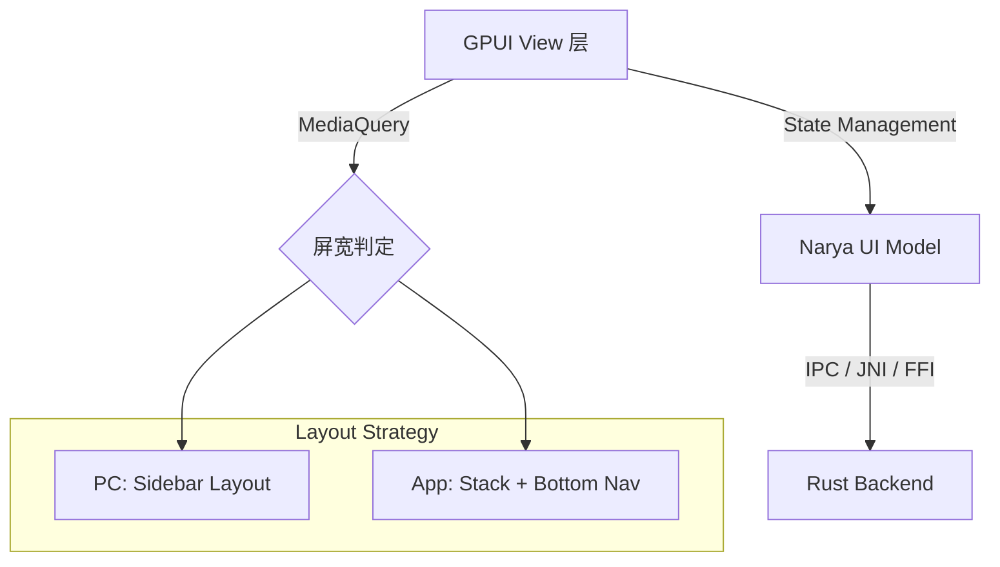

# Narya Phase 3: GUI 展现层与全平台交互设计

## 1. 视觉方案与参考

本方案融合了市面上顶尖代理客户端的长处，旨在打造一个专业、高效且对新手友好的界面。

| 参考对象 | 借鉴点 |
| :--- | :--- |
| **Clash Verge Rev** | 仪表盘的专业度、多 Profile 管理、实时连接详情 |
| **Karing** | 极致简单的“直连/代理”白名单拖拽逻辑 |
| **Hiddify Next** | 全平台（手机+桌面）的自适应布局设计 |
| **Bettbox** | 直观的状态切换与节点延迟展示 |
| **Ant Design Pro** | 极客美学、严谨的间距与色彩体系 |

## 2. 页面结构设计 (PC 端 vs. 移动端)

### 2.1 PC 端 (桌面版)
*   **侧边导航栏 (Sidebar)**：Home, Proxies, Profiles, Rules, Logs, Settings。
*   **主内容区 (Main Content)**：多面板网格布局，支持自定义卡片。
*   **悬浮控制球/托盘菜单**：一键切换模式，查看即时速率。

### 2.2 移动端 (App 版)
*   **底部导航 (Bottom Nav)**：首页、代理、规则、更多。
*   **大卡片模式**：首页突出显示“连接/断开”大按钮，流量图简化为波图。
*   **手势操作**：侧滑切换 Profile，长按节点进行测速。

## 3. 核心功能模块详细设计

### 3.1 仪表盘 (Dashboard)
*   **实时流量图**：基于 GPUI Canvas 绘制的 60FPS 丝滑曲线（上行/下行独立颜色）。
*   **连接统计**：显示当前活跃 TCP/UDP 连接数、已命中规则统计。
*   **核心状态**：内核版本、运行时间、内存占用（体现 Rust 极致性能）。

### 3.2 代理节点 (Proxies)
*   **拓扑视图**：展示策略组的嵌套结构（Relay -> Fallback -> Node）。
*   **节点列表**：
    *   卡片式布局，带延迟色块（绿色<100ms, 黄色, 红色）。
    *   支持搜索、过滤（仅看已选、仅看在线）。
    *   一键全测速（并发 HTTP 握手测速）。

### 3.3 订阅管理 (Profiles)
*   **订阅卡片**：显示订阅剩余流量、到期时间（进度条形式）。
*   **脚本预处理**：可视化展示当前 Profile 加载了哪些 JavaScript 处理脚本。
*   **版本管理**：支持一键回滚到之前的配置版本。

### 3.4 智能分流 (Rules) - **重点交互项**
*   **App 拖拽面板**：
    *   左栏：系统中已安装/已联网的 App 列表（带图标）。
    *   右栏：白名单区（直连）、代理区。
    *   操作：像移动手机图标一样将 App 从左侧拖入右侧，底层自动生成 cgroup/process-name 规则。
*   **规则集订阅**：支持导入远程规则集（如 ACL4SSR）。

### 3.5 实时监控 (Connections)
*   **流式列表**：类似 Wireshark 的实时滚动列表。
*   **点击详情**：显示连接的进程 ID、图标、目标域名、命中的具体规则条目。

## 4. 全平台 UI 元素规范

*   **色彩体系**：
    *   品牌色：Narya Blue (#1677ff)
    *   直连：Success Green (#52c41a)
    *   代理：Warning Orange (#faad14)
    *   拒绝：Error Red (#ff4d4f)
*   **字体**：
    *   优先使用系统原生字体（SF Pro for macOS/iOS, Segoe UI for Windows, Roboto for Android/Linux）。
    *   代码区域使用 JetBrains Mono。
*   **动画**：
    *   微交互：按钮点击后的涟漪、节点切换时的位移平滑。
    *   加载态：骨架屏设计，杜绝白屏感。

## 5. 跨平台适配架构 (GPUI Mobile)

## 6. 开发优先级

1.  **Stage 1**: 构建主框架（侧边栏/底部导航）与 GPUI 基础组件库。
2.  **Stage 2**: 实现 Dashboard 流量图与节点列表。
3.  **Stage 3**: 开发白名单拖拽面板与 IPC 联动。
4.  **Stage 4**: 针对移动端触摸事件进行特化优化。
